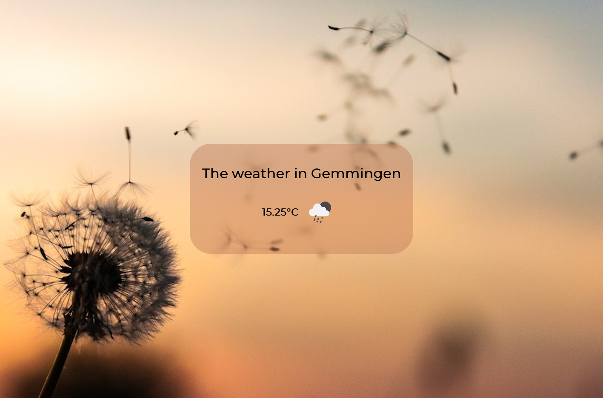

# Just another weather app

I created this weather app as a practice project. My main learning focus was getting my hands dirty with React Hooks what you'll see in the code.

**Feel free to follow my journey:**

<a href="https://twitter.com/coding_max?ref_src=twsrc%5Etfw" class="twitter-follow-button" data-size="large" data-dnt="true" data-show-count="false">Follow @coding_max</a>

# Used materials

During my researches I found following articles very useful:

- [Creating React usePosition() hook for getting browser’s geolocation](https://itnext.io/creating-react-useposition-hook-for-getting-browsers-geolocation-2f27fc1d96de)
- [Add state and lifecycle methods to Function Components with React Hooks](https://itnext.io/add-state-and-lifecycle-methods-to-function-components-with-react-hooks-8e2bdc44d43d)

The background image is taken from here:
<a style="background-color:black;color:white;text-decoration:none;padding:4px 6px;font-family:-apple-system, BlinkMacSystemFont, &quot;San Francisco&quot;, &quot;Helvetica Neue&quot;, Helvetica, Ubuntu, Roboto, Noto, &quot;Segoe UI&quot;, Arial, sans-serif;font-size:12px;font-weight:bold;line-height:1.2;display:inline-block;border-radius:3px" href="https://unsplash.com/@davealmine?utm_medium=referral&amp;utm_campaign=photographer-credit&amp;utm_content=creditBadge" target="_blank" rel="noopener noreferrer" title="Download free do whatever you want high-resolution photos from Dawid Zawiła"><svg xmlns="http://www.w3.org/2000/svg" style="height:12px;width:auto;position:relative;vertical-align:middle;top:-2px;fill:white" viewBox="0 0 32 32"><title>unsplash-logo</title><path d="M10 9V0h12v9H10zm12 5h10v18H0V14h10v9h12v-9z"></path></svg>Dawid Zawiła</a>

This project was bootstrapped with [Create React App](https://github.com/facebook/create-react-app).
